# Chọn FileOwner hay Custom class khi tạo một Custom UIView
<br>
Thông thường chúng ta có 3 cách dùng khi tạo 1 file custom UIView. Chúng ta hãy cùng làm theo cả 3 cách sau đây để xem ưu, nhược điểm của từng cái nhé.

A. Set File owner 

B. Set Custom class

C. Set cả hai File owner và Custom class

Giờ hãy tạo 1 Tabbar Controller chứa 3 view controller để thực hành add custom view theo 3 cách trên nhé.

## **Cách A. Thêm custom view dùng File owner**

- Trước hết, ta cần hiểu FIleOwner là gì? [File owner](https://developer.apple.com/library/archive/documentation/Cocoa/Conceptual/LoadingResources/CocoaNibs/CocoaNibs.html#//apple_ref/doc/uid/10000051i-CH4-SW15) là một controller object giúp ta kết nối code với các elements, UI trong file nib. 

- Bước 1: Tạo file xib và class “CustomViewA”

> Views có thể được tạo bằng hai cách:
> 
> 
> + Tạo view bằng code, ta gọi hàm `init(frame: CGRect)`
> 
> + Nếu dùng file nib, khi file nib được load sẽ gọi hàm  `init?(coder: NSCoder)` 
> 
> Nếu muốn support cả 2 cách, ta implement cả 2 hàm trên
> 

Ở ví dụ này ta tạo custom view bằng cách dùng file nib chứ không dùng code

Tạo file xib *CustomViewA.xib*

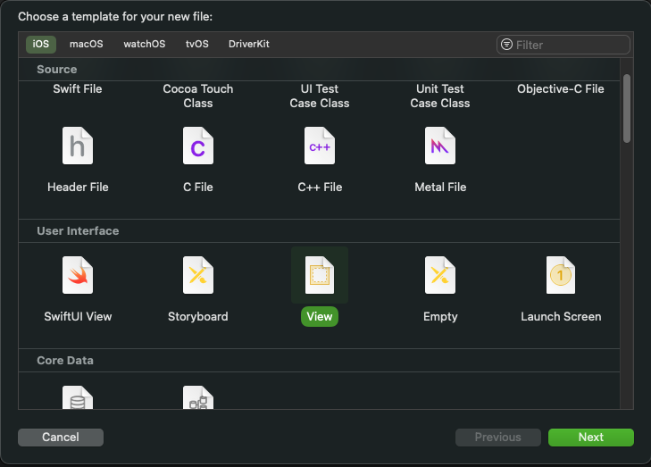

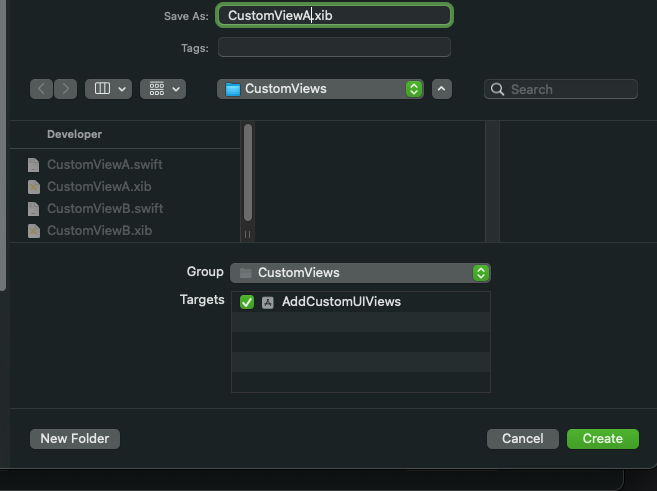

Tạo file *CustomViewA.swift*. Ở file CustomViewA.swift, ta setup code như sau:

```swift
import UIKit

final class CustomViewA: UIView {
    override init(frame: CGRect) {
        super.init(frame: frame)
        initView()
    }
    
    required init?(coder: NSCoder) {
        super.init(coder: coder)
        initView()
    }
    
    private func initView() {
        // Để load file nib, ta tạo một instance của UINib
        // Ta set bundle là nil để dùng bundle default
        let nib = UINib(nibName: "CustomViewA", bundle: nil)
        
        // Khởi tạo contents trong file nib, objects là 1 array của tất cả top-level objects trong file nibs
        let objects = nib.instantiate(withOwner: self, options: nil)
        
        // Lưu ý: Vì list object trả ra từ file nib chưa thuộc view hierarchy nào nên ta phải addSubview vào CustomViewA
        if let view = objects.first as? UIView {
            view.backgroundColor = .clear
            addSubview(view)
            view.frame = bounds
            view.backgroundColor = .orange
        }
    }
}
```

- Bước 2: Set class cho file owner

Mở file xib, chọn File’s Owner, rồi set Custom class là “**CustomViewA”** vừa tạo

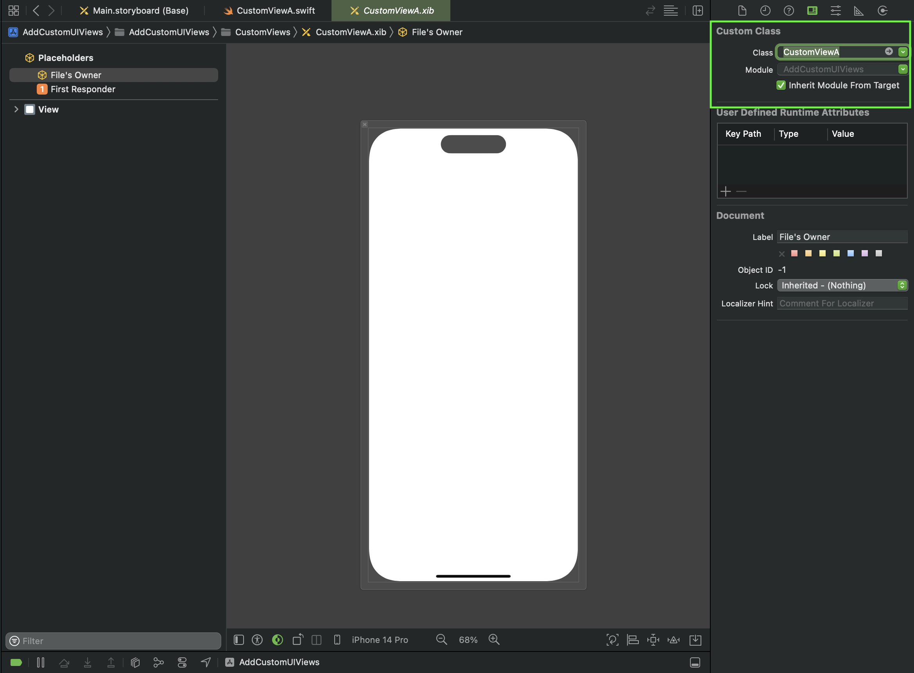

- Bước 3: Mở “ViewControllerA” trong storyboard, kéo một view vào rồi set Custom Class cho nó là “CustomViewA”.

Chạy app và ta đã tạo được một custom view, kết quả như hình bên dưới.

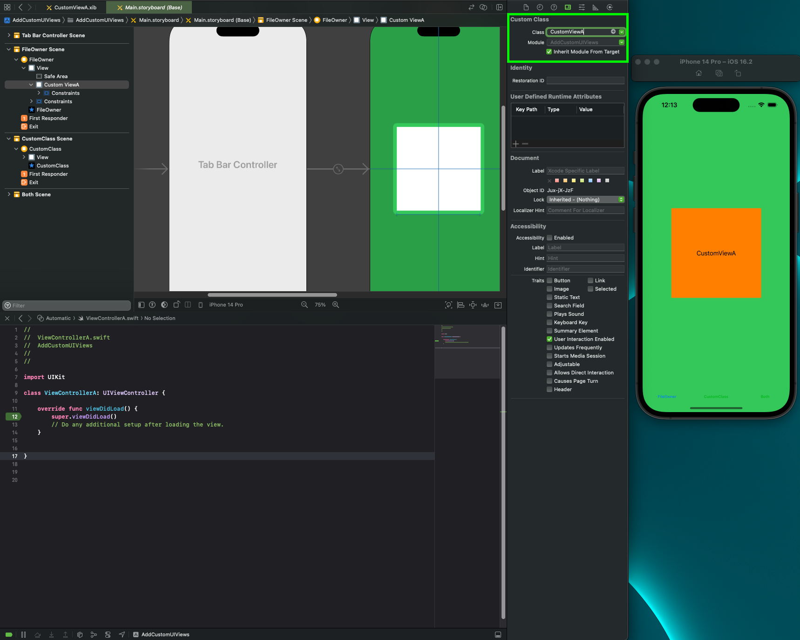

## **Cách B. Thêm custom view dùng Custom Class**

- Bước 1:

Tạo file *CustomViewB* giống file *CustomViewA* như ở cách A

- Bước 2:

Thay vì FileOwner như cách A, ta chọn View ở dưới, rồi set Custom Class là “***CustomViewB***”

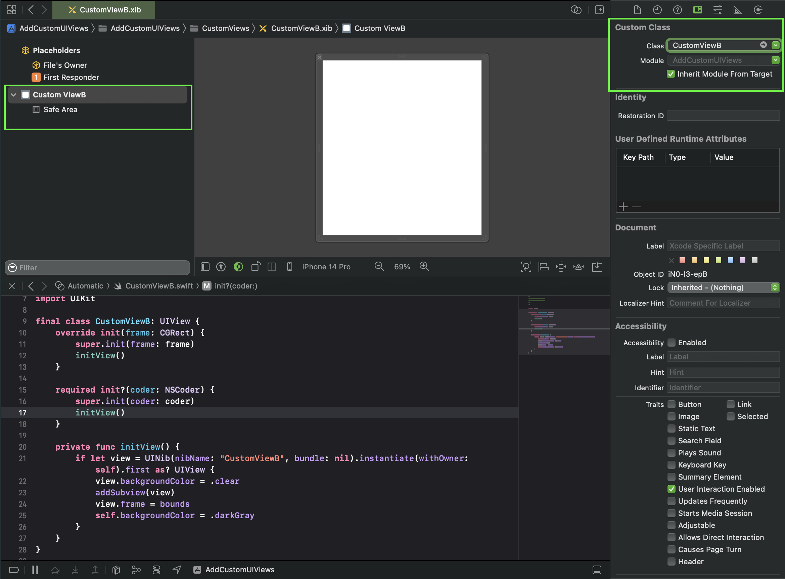

- Bước 3: Ta cũng kéo view “CustomViewB” vừa tạo vào ViewControllerB như bước 3 cách A, rồi chạy app

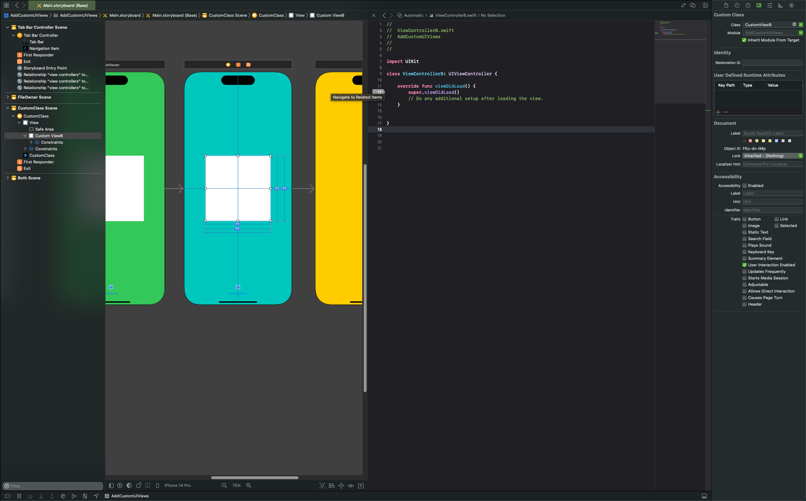

Oops!!! Cách này dùng thì lại bị crash. Tại sao lại thế???

> Lý do vì khi load ViewControllerB, app sẽ call  `init?(coder: NSCoder)` của custom view (CustomViewB), tiếp theo sẽ call  `initView()` . Trong hàm này ta dùng `instantiate(withOwner`) để load file Nib. Tuy nhiên, vì ở bước 2 ta đã set top-level view của file nib là class `CustomViewB` nên nó sẽ load lại file nib và call hàm `init?(coder: NSCoder)` một lần nữa. Cứ thế nó sẽ tạo 1 vòng loop vô hạn khiến app bị crash.
> 

> Để tránh trường hợp này, ta bỏ hàm `initView()` ra ngoài, không để trong `init?(coder: NSCoder)` or `init(frame: CGRect)` nữa.
> 

- Bước 4: Move hàm load xib ra bên ngoài View Controller (parent view controller)

```swift
import UIKit

class ViewControllerB: UIViewController {
    
    var viewCustomB: CustomViewB!
    
    override func viewDidLoad() {
        super.viewDidLoad()
        // Do any additional setup after loading the view.
        initView()
    }
    
    private func initView() {
        let nib = UINib(nibName: "CustomViewB", bundle: nil)
        let objects = nib.instantiate(withOwner: nil, options: nil)

        if let firstView = objects.first as? CustomViewB {
            firstView.backgroundColor = .red
            viewCustomB = firstView
            view.addSubview(viewCustomB)
            viewCustomB.translatesAutoresizingMaskIntoConstraints = false
            viewCustomB.widthAnchor.constraint(equalToConstant: 240).isActive = true
            viewCustomB.heightAnchor.constraint(equalTo: viewCustomB.widthAnchor).isActive = true
            viewCustomB.centerXAnchor.constraint(equalTo: view.centerXAnchor).isActive = true
            viewCustomB.centerYAnchor.constraint(equalTo: view.centerYAnchor).isActive = true
        }
    }
}
```

Chạy app và ta đã tạo được một custom view, kết quả như hình bên dưới.

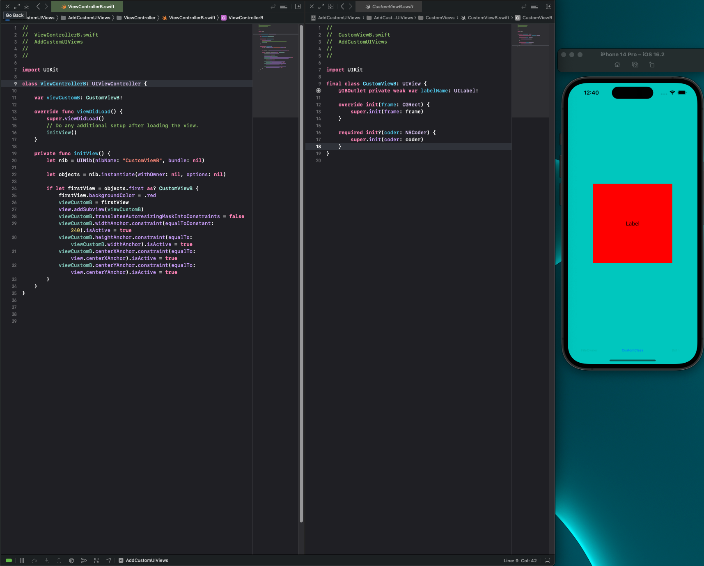

Như vậy ta vẫn có thể add custom view bằng cách B này, nhưng nó có nhược điểm:

- Ta sẽ phải load file nib *(CustomViewB.xib)* mọi nơi mà ta muốn dùng nó và sẽ gây ra duplicate code.

## **Cách C. Thêm custom view dùng Custom Class và FileOwner**

- Bước 1: Tạo file *CustomViewC.swift và CustomViewC.xib*  giống file *CustomViewA* như ở cách A
- Bước 2: Tạo 1 button ở giữa view
- Bước 3: Lần này, ta set CustomClass của view là “*CustomViewC*”, còn set FileOwner là parent class của nó (ViewControllerC)

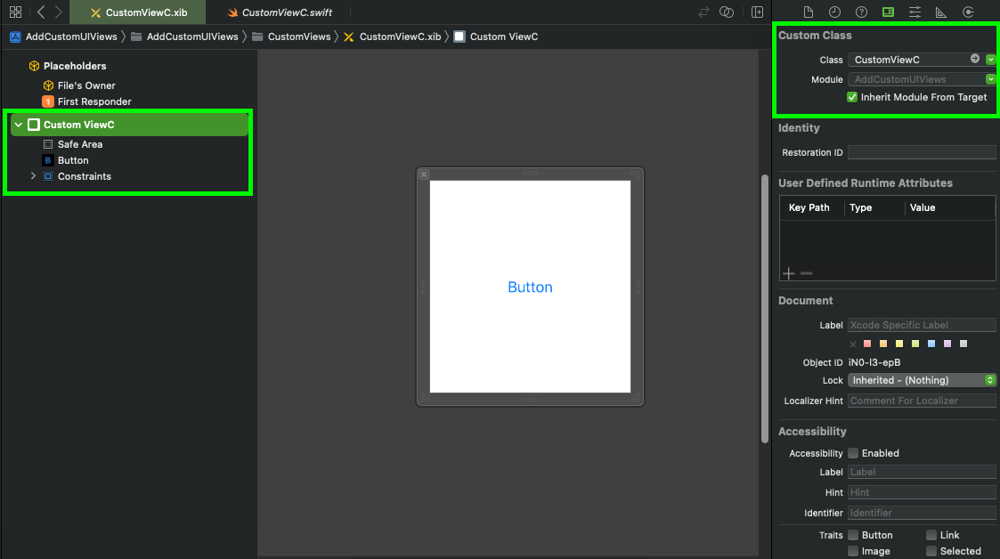

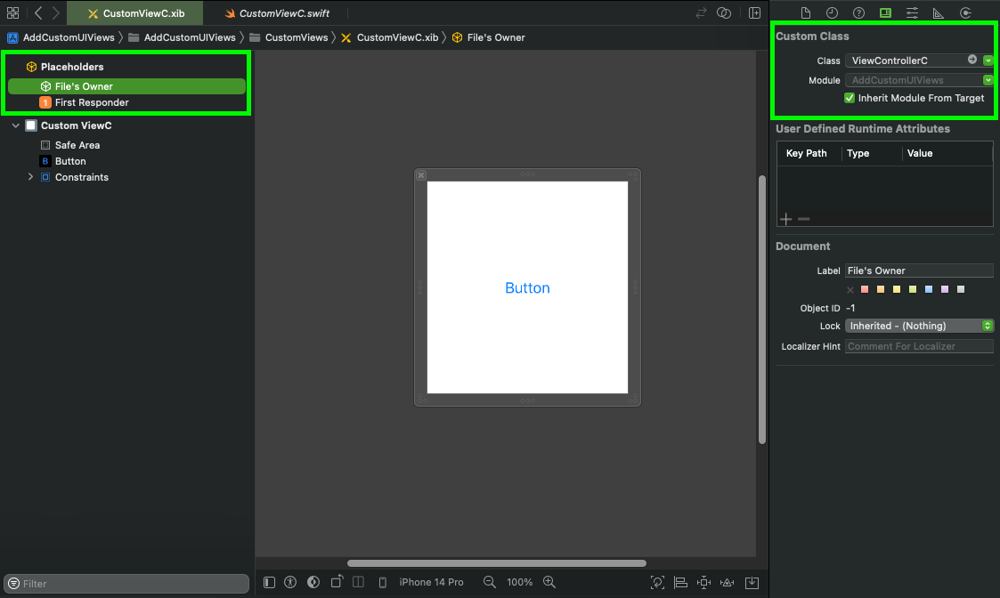

- Bước 4: Để logic load file xib ở parent class (để tránh crash như cách B) và kéo IBAction của button vào cả parent và custom view class

Khi tap button, ta thấy debug đều chỉ ra cùng là một object.

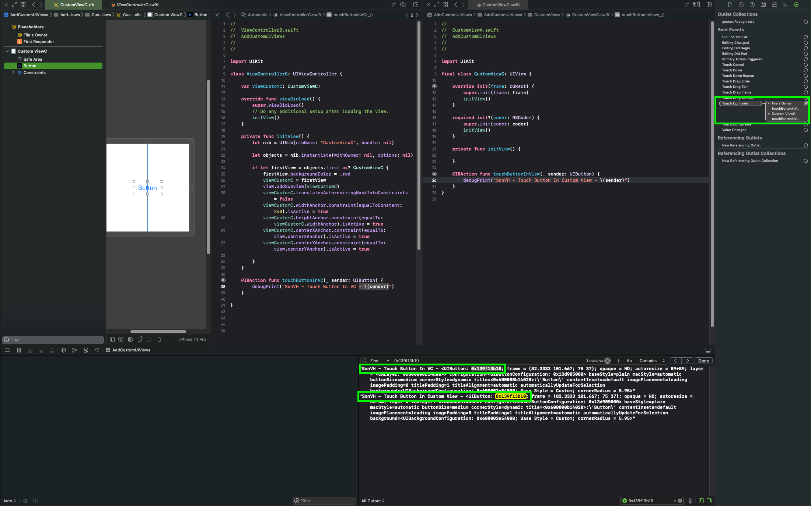

Ok vậy ta đã thử qua 3 cách để tạo một custom view, ta có thể thấy rằng cách A đầu tiên dùng FileOwner là tiện lợi nhất

- Dễ reuse trong toàn app thông qua code, xib hoặc storyboards
- Không dính crash, tránh duplicate code như cách B

Sau đây là một số tip mà các bạn chắc cũng đã biết =)))

*Tip1: Ở trong file xib, bạn có thể chọn Size “**Freeform**” trong Attribute Inspector để resize view*

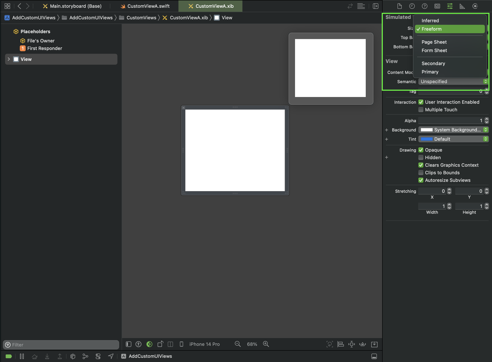

*Tip2: Trong cách A, ta có thể tạo một outlet **contentView*** là top-level view của file xib, từ đó không cần phải get first object khi instantiate xib file nữa.

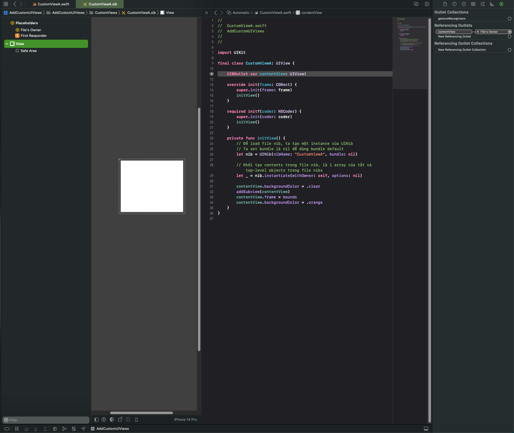

Bài viết tham khảo nguồn từ:

[https://medium.com/@bhupendra.trivedi14/understanding-custom-uiview-in-depth-setting-file-owner-vs-custom-class-e2cab4bb9df8](https://medium.com/@bhupendra.trivedi14/understanding-custom-uiview-in-depth-setting-file-owner-vs-custom-class-e2cab4bb9df8)

[https://github.com/codepath/ios_guides/wiki/Custom-Views#how-views-are-defined-and-instantiated](https://github.com/codepath/ios_guides/wiki/Custom-Views#how-views-are-defined-and-instantiated)
