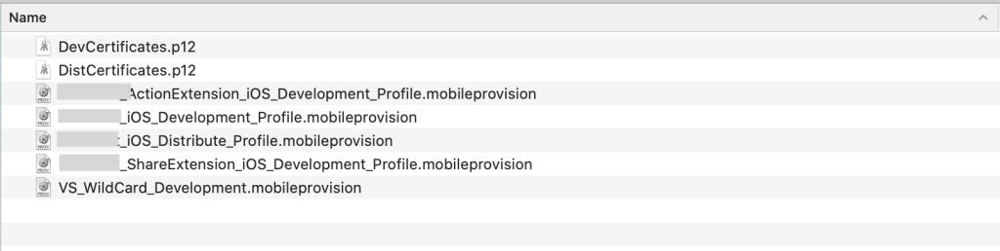

# Hướng dẫn tạo và sử dụng Manually Signing App
 
*Link tham khảo: [https://help.apple.com/developer-account/](https://help.apple.com/developer-account/)*

Code Signing là một thứ bắt buộc để ta có thể cài đặt ứng dụng vào devices thật, hoặc để upload lên AppStore Connect. Có hai cách để cài đặt code signing, “Automatically manage signing” hoặc “Manually manage signing”. Bài viết này sẽ hướng dẫn cài đặt **manual code signing**.

Để cài đặt app, bạn cần có :

- Signing certificate (Personal Information Exchange, .p12)
- Provisioning profile (.mobileprovision)

**Signing certificate** là chứng chỉ giúp xác định danh tính để cài app

**Provision profile** (development hoặc distribution) chứa những thông tin về appID, các devices mà app có thể cài đặt, thông tin certificate để signing app. *Lưu ý rằng nếu ứng dụng có chứa các extensions, bạn cần thêm các provision profile tương ứng*

Mỗi dự án sẽ có những certificate và provision profile riêng. Như ảnh dưới, ta có 2 certificate, cho môi trường dev và distribute, ta cũng có các provision dev và distribute tương ứng, kèm theo đó là những provision profile của các extension của app.

## Sau đây là hướng dẫn tạo manually signing app:

**B1. Tạo certificate cho app**

1. Ở Certificates, Identifiers & Profiles, chọn Certificates

2. Chọn nút (+)

3. Chọn loại certificates mà mình muốn và chọn nút “Tiếp tục”    
    
    

4. Tạo certificate signing request

    4.1. Mở app Keychain Access ở máy

    4.2. Chọn Keychain Access > Certificate Assistant > Request a Certificate from a Certificate Authority.

    4.3. Điền thông tin như email, name, bổ trống CA Email Address

    4.4. Chọn “Save to disk” và chọn tiếp tục

    
    
    

5. Chọn file đuôi .certSigningRequest đã tạo ở b4

6. Chọn “Tiếp tục” và “Tải về” máy. (File certificate sẽ có đuôi .cer)

**B2. Đăng ký AppID**

AppID sẽ định danh app của bạn trong provisioning profile. Có 2 loại AppID: **explicit AppID** (sử dụng riêng từng app) và **wildcard AppID** (sử dụng chung 1 số app). Wildcard AppID sẽ chỉ enable được một số Capabilities, nếu muốn sử dụng những Capabilities khác, bạn phải tạo explicit AppID

Các bước tạo AppID:

1. Trong Certificates, Identifiers & Profiles, chọn “Identifiers”, rồi chọn (+)
2. Chọn AppIDs
3. Điền name, descriptions, chọn các loại Capabilities mà app sẽ dùng
- Nếu chọn **Explicit App ID**, bạn phải điền giống bundleID của app trong Xcode
- Nếu chọn **Wildcard App ID**, bạn phải điền bundle ID với hậu tố (VD: com.domainname.*)
    
    
    

**B3. Đăng ký devices**

Đăng ký một device:

1. Trong Certificates, Identifiers & Profiles, chọn Devices, rồi chọn (+)
2. Chọn platform, điền device name, device ID (UDID)
3. Chọn tiếp tục, chọn “Register” để hoàn tất đăng ký

Đăng ký nhiều device:

Bạn có thể dùng app “Configurator 2” trên MacAppStore hoặc tạo file .txt chứa thông tin (mỗi dòng chứa deviceID, device name, platform name cách nhau bởi tab-delimited)

**B4. Tạo provisioning profile**

1. Trong Certificates, Identifiers & Profiles, chọn Profiles, rồi chọn nút (+)
2. Chọn loại provisioning profile mà bạn muốn tạo, rồi chọn “Tiếp tục”
- 
    
    
    

3. Chọn App ID mà mình đã tạo ở Bước 2, chọn “Tiếp tục”

- 
    
    
    

4. Chọn Certificate mà mình đã tạo ở Bước 1, chọn “Tiếp tục”

- 
    
    
    

5. Chọn các device đã được tạo ở Bước 3, chọn “Tiếp tục”

- 
    
    
    

6. Điền profile name, rồi chọn “Generate”

7. Chọn “Download” để tải về

8. Sau khi đã tải về, click double vào các certificate và nhập mật khẩu để add vào keychain

- Tắt Automatically manage signing trong Xcode

- Import các provision profile tương ứng

Nếu status không còn báo đỏ nữa là bạn đã import thành công. Giờ run và build thôi.
