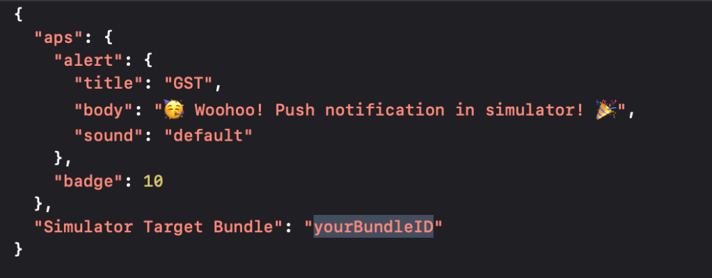
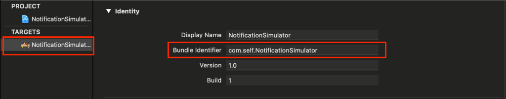
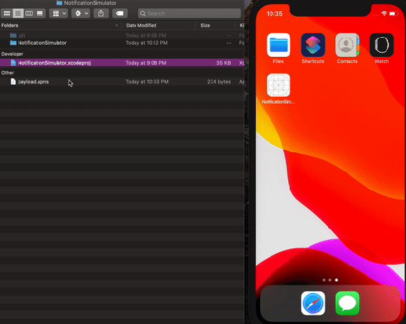
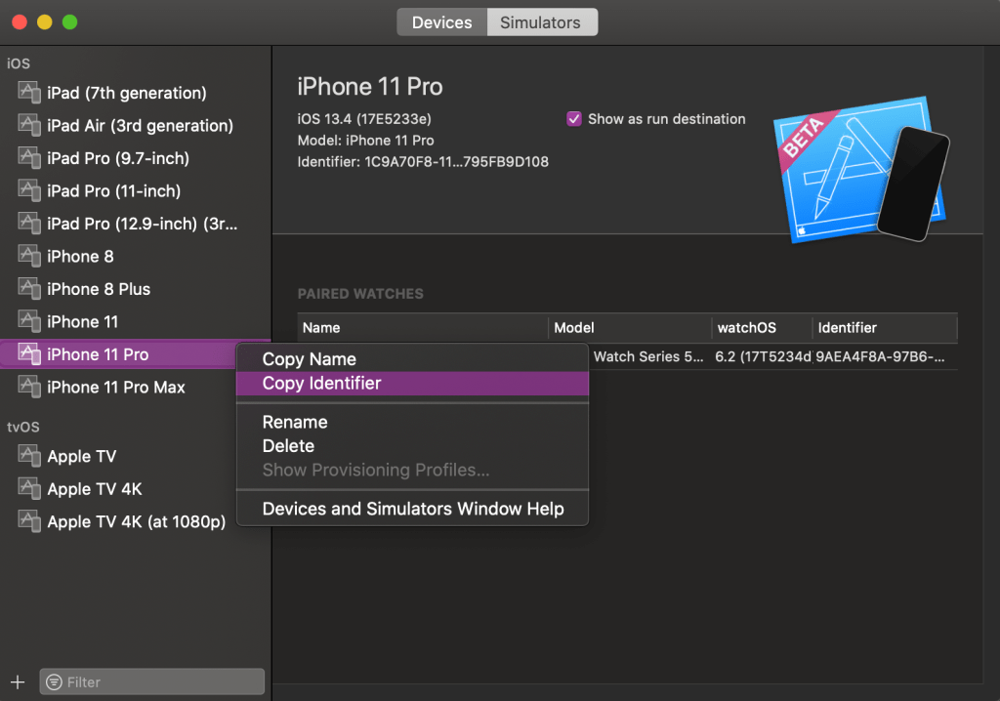
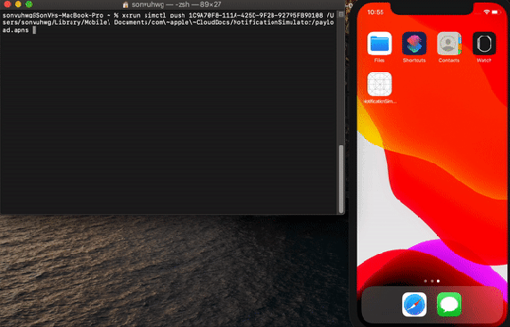

# Push Notification trên iOS Simulator
 
Như các bạn đã biết, để dùng APNS (Apple Push Notification service) thì chúng ta cần phải có device thật. Nhưng chuyện đó đã là quá khứ khi ở bản 11.4 beta, Apple đã cho phép test push notification ngay trên simulator. Tuyệt vời !!! 😍

Để có thể push notification trên simulator, bạn cần:

**Bước 1:** Tải **Xcode 11.4** beta hoặc các phiên bản mới hơn tại link nè: [https://developer.apple.com/download/](https://developer.apple.com/download/)

**Bước 2:** Tạo project và grant permission

Ở **Appdelegate.swift**, import framework **UserNotifications**, và yêu cầu quyền nhận notification ở hàm **application(_:didFinishLaunchingWithOptions:)**

**Bước 3:** Tạo file **APNS payload**

APNS payload là một file json dictionary chứa đựng các thông tin của Notification như kiểu thông báo, nội dung thông báo… Bạn có thể vào đây để xem thêm chi tiết:

[https://developer.apple.com/documentation/usernotifications/setting_up_a_remote_notification_server/generating_a_remote_notification](https://developer.apple.com/documentation/usernotifications/setting_up_a_remote_notification_server/generating_a_remote_notification)

Mình tạo file payload thêm 1 key *“Simulator Target Bundle”* như sau:

Trong đó “yourBundleID” là bundleID app của bạn, bundle project của mình là “**com.self.NotificationSimulator**”

**Bước 4:**  Giờ kéo thả vào simulator thôi!

Giờ bạn hãy kéo file payload vừa tạo vào simulator, xem điều kì diệu gì xảy ra nhé

Simulator đã có notification 🎉

Ngoài cách kéo thả file APNS vào Simulator, ta còn có thể dùng câu lệnh Command để gửi noti. Ở Xcode 11.4 này đã có thêm command `xcrun simctl push` hỗ trợ việc bắn notification.

`xcrun simctl push <simulator-identifier> <path-to-payload-file>`

trong đó <simulator-identifier> là ID của simulator, <path-to-payload-file> là đường dẫn đến file payload. Bạn có thể lấy ID simulator như sau:

Nếu bạn ngại việc copy identifier, bạn có thể dùng `xcrun simctl push booted <path-to-payload-file>` để push notification ngay trên simulator đang mở. Và kết quả:

# **Kết luận**

Giờ đây ta có thể test push notification thật đơn giản trên simulator. Ta có 2 cách để test:

– Kéo thả file APNS vào simulator

– Trỏ đường dẫn file APNS hoặc Json payload qua command line

Sau bài viết này, mình sẽ giới thiệu các bạn về **Leanplum** – một marketing platform cho mobile, và xem điểm giống và khác nhau giữa Leanplum vs Firebase nhé

Nguồn: [https://swiftsenpai.com/xcode/simulating-push-notifications-in-ios-simulator/](https://swiftsenpai.com/xcode/simulating-push-notifications-in-ios-simulator/)
